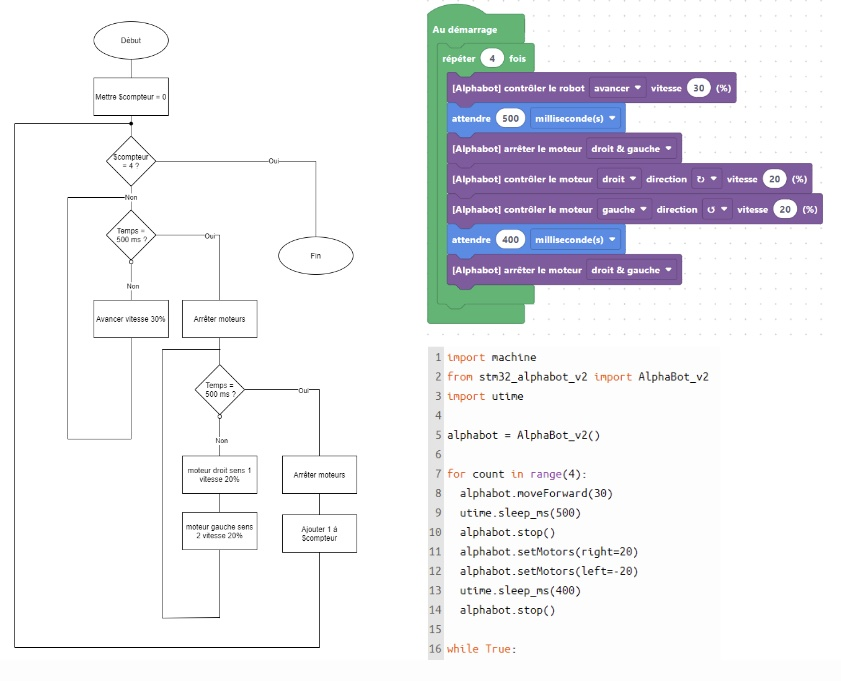

# Activités pour la reconnaissance d'images et le contrôle d'un rover

## Public ciblé

* A partir de 10 ans

## Aperçu des activités

Numéro activité | Activté | Dépend des activtés
 :--- | :--- | :--- 
1 | Reconnaissance d'images avec Google Teachable Machine |  
2 | Reconnaissance d'images avec Scratch (Adacraft) | 1  
3 | Reconnaissance d'images en Python | 1  
4 | Construction d'un rover avec Raspberry Pi |   
5 | Contrôle du rover avec un site Web | 4  
6 | Contrôle du rover avec Scratch (Adacraft) | 4 
7 | Contrôle du rover avec Python | 4
8 | Reconnaissance d'images pour le contrôle du rover avec Scratch (Adacraft) | 1, 4, 6
9 | Reconnaissance d'images pour le contrôle du rover avec Python | 2, 4, 7

## Compétences 

Les activités permettent d'appréhender et s'approprier les notions d'algorithmes, de logigrammes, et les concepts de bases de la programmation (conditions, boucles, variables).

### Référentiel FMTTN

Création de contenus

* Savoir: Programmation et logigrammes.
* Savoir-Faire: Lire un algorithme simple, Écrire un algorithme simple, Lire un programme simple, Écrire un programme simple, Identifier des éléments relatifs à la programmation et aux logigrammes.
* Compétences: Concevoir un algorithme pour résoudre un problème simple, Concevoir un programme pour résoudre un problème, Porter un regard critique sur les raisons d’être et les conséquences induites par un algorithme.

### Exemples des liens entre logigrammes - langage de bloc - langage de script

 

 

 

